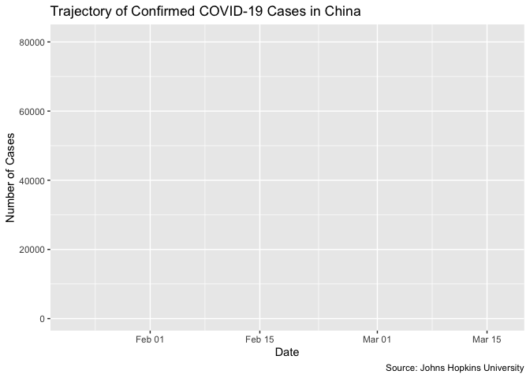

Time Series Analysis of Case Load, Recovery and Mortality Rates
================
Usman Khaliq
2020-03-18

  - [Time series analysis on Confirmed COVID cases over
    time](#time-series-analysis-on-confirmed-covid-cases-over-time)
      - [Subsection](#subsection)
  - [Section 2](#section-2)

``` r
# Libraries
library(tidyverse)
library(gganimate)
library(lubridate)

# Parameters

#Paths for the raw data files
covid_confirmed_data <- here::here("data/covid_confirmed.rds")
covid_deaths_data <- here::here("data/covid_deaths.rds")
covid_recovered_data <- here::here("data/covid_recovered.rds")
#==========================================================================

# Code
```

## Time series analysis on Confirmed COVID cases over time

First, lets read all the data into Rds objects

``` r
covid_confirmed <-
  covid_confirmed_data %>% 
  read_rds() %>% 
  rename(
    province_state = `Province/State`,
    country_region = `Country/Region`,
    lat = Lat,
    long = Long
  )

covid_deaths <-
  covid_deaths_data %>% 
  read_rds() %>% 
  rename(
    province_state = `Province/State`,
    country_region = `Country/Region`,
    lat = Lat,
    long = Long
  )

covid_recovered <-
  covid_recovered_data %>% 
  read_rds() %>% 
  rename(
    province_state = `Province/State`,
    country_region = `Country/Region`,
    lat = Lat,
    long = Long
  )
```

Now, lets wrangle the data for the confirmed cases so that we can see
the change in the values of confirmed cases over time. (note -
currently, look at country figures)

``` r
covid_confirmed %>% 
  pivot_longer(
    cols = -c(province_state, country_region, lat, long),
    names_to = "date",
    values_to = "confirmed_cases"
  ) %>% 
  group_by(country_region, date) %>% 
  summarise(confirmed_cases = sum(confirmed_cases)) %>% 
  mutate(date = mdy(date)) %>% 
  filter(country_region == "China") %>% 
  ggplot(aes(date, confirmed_cases)) +
  geom_line() +
  transition_reveal(date) +
  labs(
    title = "Trajectory of Confirmed COVID-19 Cases in China",
    x = "Date",
    y = "Number of Cases",
    caption = "Source: Johns Hopkins University"
  )
```

<!-- -->

``` r
# covid_confirmed %>% 
#   pivot_longer(
#     cols = -c(province_state, country_region, lat, long),
#     names_to = "date",
#     values_to = "confirmed_cases"
#   ) %>% 
#   group_by(country_region, date) %>% 
#   summarise(confirmed_cases = sum(confirmed_cases)) %>% 
#   mutate(date = mdy(date)) %>% 
#   ggplot(
#     aes(
#       date,
#       confirmed_cases,
#       size = confirmed_cases,
#       color = country_region
#     )
#   ) +
#   geom_point() +
#   scale_color_viridis_d() +
#   transition_reveal(date)  
```

### Subsection

## Section 2
